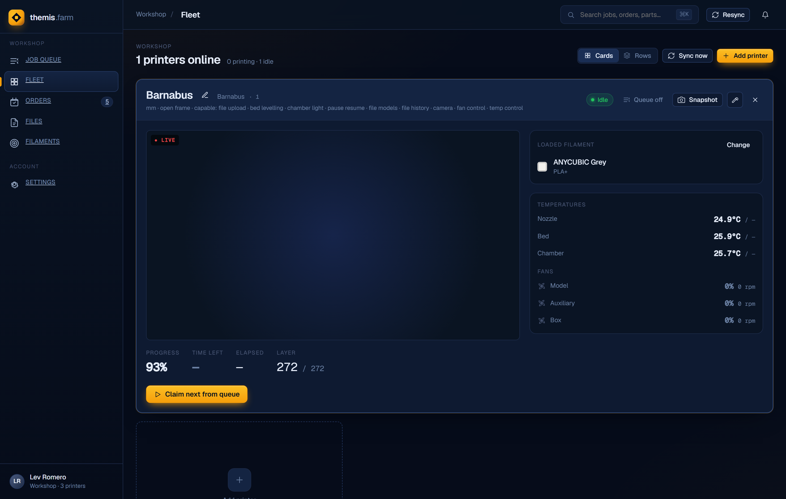
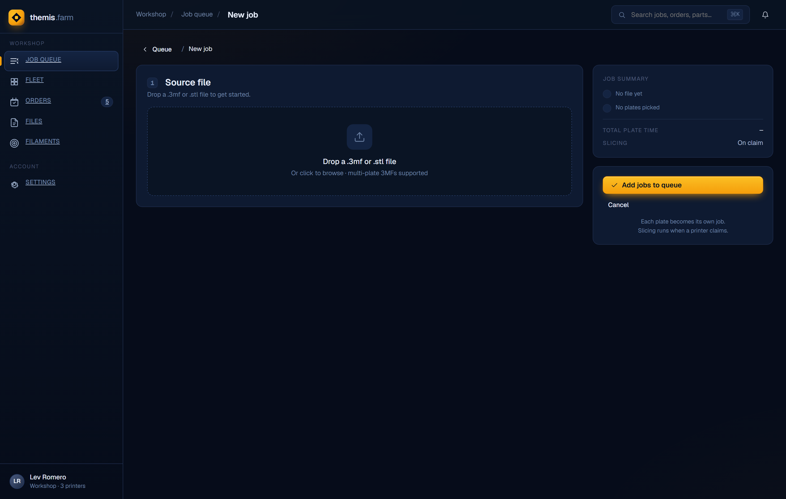

# 🏛️ Themis — 3D Print Farm Manager

Themis is a self-hosted control plane for a workshop of 3D printers. Upload a model, pick which
printers may run it, and drop it into one shared queue — Themis watches printer availability,
**slices each job with your real native OrcaSlicer presets** for the exact target machine, uploads
the result, and starts the print. Live telemetry and camera stream to the browser; filament
inventory can sync from [Spoolman](https://github.com/Donkie/Spoolman).

It runs as a **single Docker container** (FastAPI + a built React SPA), backed by SQLite — no
external services required.

> 📐 **Full design & architecture reference:** [`docs/architecture/index.html`](docs/architecture/index.html)
> — open it in a browser for diagrams, data model, and subsystem deep-dives.

---

## ✨ Features

| | |
|---|---|
| **One auto-claiming queue** | A background engine assigns queued jobs to idle, eligible printers — no manual dispatch. |
| **Native headless slicing** | Drives your installed OrcaSlicer with your own printer/process/filament presets. No GUI, no profile sync. |
| **Multi-vendor fleet** | Bambu (MQTT) and Elegoo Centauri (SDCP/WebSocket) today; new vendors = one client class + one registry entry. |
| **Multi-plate & multi-color** | Each plate of a 3MF becomes its own job; AMS / multi-tool colour slots are preserved. |
| **Filament-aware gating** | A job won't start on a printer whose loaded filament (type **and** colour) doesn't match. |
| **Spoolman integration** | Source filament choices from your Spoolman catalog; manual entry always allowed. |
| **Live camera & telemetry** | MJPEG passthrough or RTSP→MJPEG transcode, plus temps, fans, progress over WebSocket. |
| **Capability-driven UI** | Every control renders from a printer's capability flags — never a hard-coded vendor check. |

---

## 🖥️ The app

<table>
<tr>
<td width="50%"></td>
<td width="50%"></td>
</tr>
<tr>
<td align="center"><b>Fleet</b> — live camera, temps, fans, loaded filament, queue toggle</td>
<td align="center"><b>New Job</b> — drop a 3MF/STL; each plate becomes a job</td>
</tr>
</table>

| Screen | What it's for |
|---|---|
| **Queue** | The shared job list with active / pending / blocked badges, plate thumbnails, and a per-job detail panel. |
| **New Job** | Upload a model and configure each plate: eligible printers, print profile, filament, and order link. |
| **Fleet** | Printer cards with live camera + telemetry; edit a printer via a make → model → nozzle picker. |
| **Settings** | Workshop defaults, queue check interval, **Rescan profiles**, and Spoolman integration. |

---

## 🔁 How a job flows

```
Upload .3mf/.stl ─▶ pick eligible printers + profile + filament ─▶ enqueue
                                                                      │
        ┌─────────────────────────────────────────────────────────────┘
        ▼
Queue engine: a printer goes idle (queue_on) ─▶ is it eligible?
        │                                            │
        │  filament/slice mismatch ─▶ BLOCKED ◀──────┘  (stays in queue, retried)
        ▼
   slice for THIS machine (OrcaSlicer) ─▶ upload ─▶ start print ─▶ printing ─▶ complete
        │
        └─ slice fails ─▶ retry geometry-only ─▶ still fails ─▶ BLOCKED (another printer may rescue)
```

- **Blocked ≠ failed.** A filament/slice issue *blocks* a job (transient — re-evaluated every cycle, so
  loading the right spool unblocks it). Only a post-slice upload/start error *fails* it (terminal).
- **Head-of-line:** if the first eligible job can't run on a printer, that printer waits rather than
  skipping ahead.

See the [architecture doc](docs/architecture/index.html) for the full state machine and slicing pipeline.

---

## 🚀 Getting started

### Prerequisites
- **OrcaSlicer** installed, with your printer/process/filament presets configured.
- **Docker** (for the container) *or* Python 3.13 + Node 18+ (for local dev).

### Docker (production)
```bash
# .env must define APPDATA so your host OrcaSlicer config is bind-mounted in
docker compose up --build
```
The container serves the app on its mapped port. Your `%APPDATA%\OrcaSlicer` is mounted read-only at
`/root/.config/OrcaSlicer`, so presets you edit on the host are immediately available to the slicer.

### Local development
```bash
# Backend (FastAPI on :8001)
cd backend
python -m venv .venv && .venv\Scripts\activate
pip install -e ".[dev]"
# point the resolver at your host OrcaSlicer config (Windows):
set ORCA_CONFIG_DIR=%APPDATA%\OrcaSlicer
uvicorn app.main:app --reload --port 8001

# Frontend (Vite on :5173, proxies /api and /ws → :8001)
cd frontend
npm install
npm run dev
```
Open <http://localhost:5173>.

> On Windows the backend **must** see `ORCA_CONFIG_DIR=%APPDATA%\OrcaSlicer`, or the slicer finds no
> presets (it defaults to the in-container path).

---

## 🧱 Architecture at a glance

- **Backend** — one FastAPI process: REST API + WebSocket hub + static SPA host. Three in-process
  subsystems: `PrinterManager` (vendor clients + state), `QueueEngine` (asyncio claim loop), and
  `SlicerService` (OrcaSlicer runs on a thread pool).
- **Slicing** — Themis *generates an embedded-config 3MF* and slices that, because OrcaSlicer's
  `--load-settings` can't establish the active printer. Presets are resolved through their
  inheritance chain; a `ProfileIndex` keyed by *(printer model, nozzle)* drives the compatible-profile
  dropdowns.
- **Persistence** — SQLite (WAL) via async SQLAlchemy. Tables: `printers`, `uploaded_files`,
  `projects`, `jobs`, `job_printer_configs`, `gcode_files`, `queue_config`, `spoolman_config`.
- **Frontend** — React + Vite + TypeScript, React Router. No global store; per-screen hooks fetch on
  mount and merge live WebSocket events.

```
backend/app
├── main.py              # app, lifespan wiring, static host
├── models.py            # SQLAlchemy tables
├── api/routes/          # files, fleet, jobs, printers, projects, queue, settings, spoolman
└── services/
    ├── printer_manager.py        abstract_printer_client.py
    ├── bambu_mqtt.py             elegoo_centauri_client.py
    ├── queue_engine.py           slicer_service.py
    ├── preset_resolver.py        profile_index.py
    ├── project_config_builder.py mesh_3mf_builder.py
    ├── override_inspector.py     three_mf_parser.py
    ├── spoolman_service.py       camera_proxy.py
    └── orca_reference/           # reference project/model config templates
frontend/src
├── App.tsx              # shell, routes, queue badges
├── screens/             # Queue, NewJob, Fleet, Settings, Files, Filaments, Orders
├── components/          # Sidebar, Topbar, ui, icons
└── api/                 # fleet, printers, queue, spoolman (typed clients + hooks)
```

---

## 🛠️ Commands

```bash
# Backend tests
cd backend && pytest -v
pytest tests/services/test_profile_index.py -q   # a single file

# Frontend
cd frontend && npm run build      # production build → frontend/dist/
npm test                          # Vitest

# Docker
docker build -t themis:dev .
docker compose up --build
```

---

## 📚 Documentation

| Doc | Contents |
|---|---|
| [`docs/architecture/index.html`](docs/architecture/index.html) | **As-built** design & architecture — diagrams, data model, subsystems, API, gotchas. |
| [`docs/superpowers/specs/`](docs/superpowers/specs/) | Original design specs (historical; superseded where they conflict with the architecture doc). |
| [`docs/printer-interface.md`](docs/printer-interface.md) | The `AbstractPrinterClient` / capability / factory pattern. |
| [`docs/elegoo-centauri-client.md`](docs/elegoo-centauri-client.md) | SDCP protocol notes for the Elegoo Centauri client. |
| [`CLAUDE.md`](CLAUDE.md) | Repo conventions & quick command reference. |

---

## ⚙️ Configuration

| Variable | Default | Purpose |
|---|---|---|
| `THEMIS_DATA_DIR` | `/data` | SQLite DB, uploads, gcode cache |
| `ORCA_CONFIG_DIR` | `/root/.config/OrcaSlicer` | OrcaSlicer preset directory (bind-mounted from the host) |
| `ORCA_EXECUTABLE` | `orcaslicer` | OrcaSlicer CLI path |
| `FFMPEG_EXECUTABLE` | `ffmpeg` | RTSP→MJPEG camera transcode |
| `THEMIS_STATIC_DIR` | `../frontend/dist` | Built SPA assets (production) |
