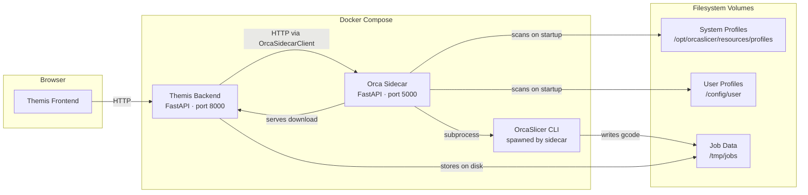
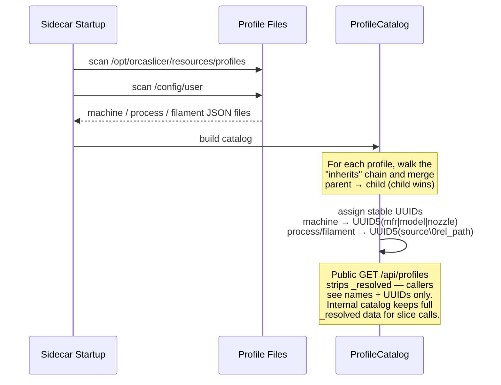
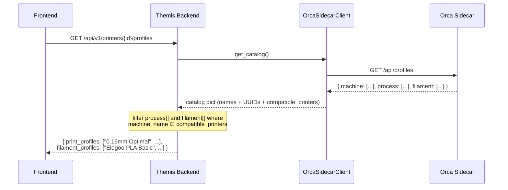
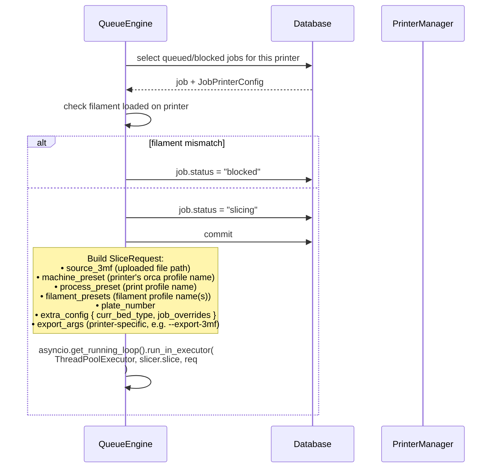
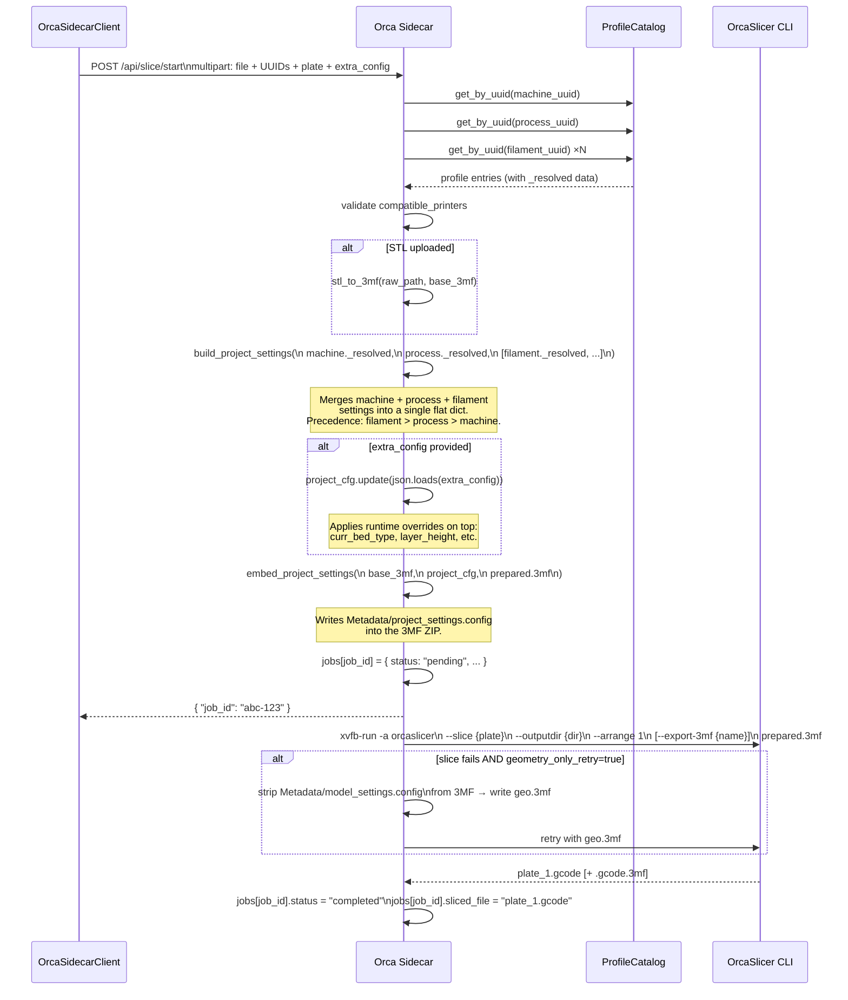
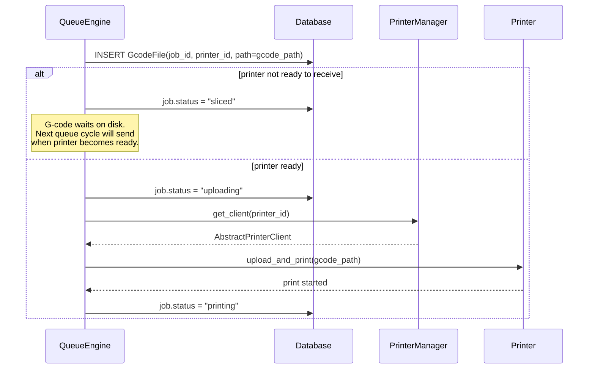
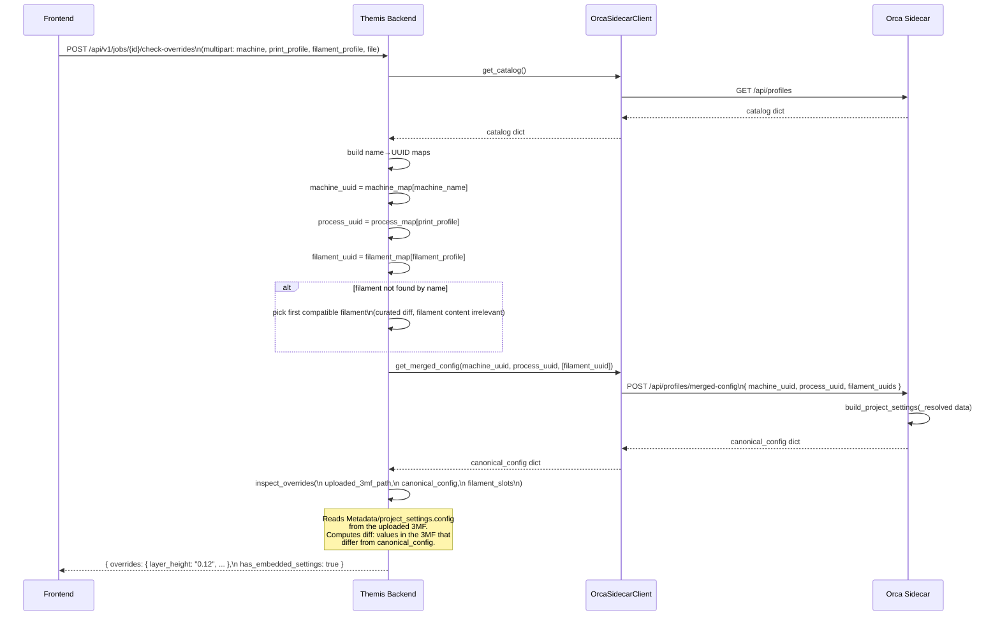
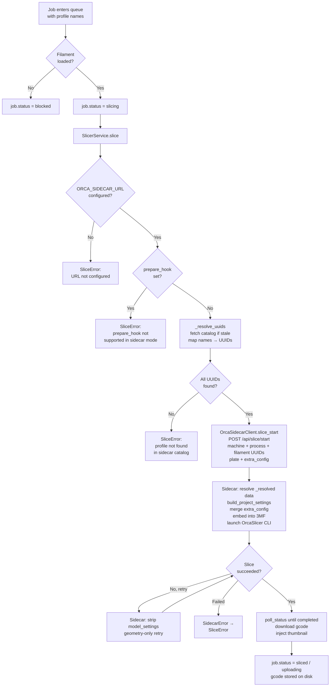

# Slicing Flow: Themis + Orca Sidecar

This document describes how a print job moves from the Themis queue through the Orca sidecar to a sliced G-code file, including profile resolution and the check-overrides inspection workflow.

---

## Architecture Overview



**Themis Backend** owns the print queue, job lifecycle, and printer communication.  
**Orca Sidecar** owns everything slicing-related: the profile catalog, 3MF assembly, and OrcaSlicer invocation.  
**Themis never reads profile files directly.** It holds only the names users see (e.g. `"Elegoo Centauri Carbon"`) and the stable UUIDs it discovers from the sidecar catalog.

---

## 1. Sidecar Startup — Building the Profile Catalog

On container start, the sidecar scans both the system profiles directory and the user config directory to build an in-memory `ProfileCatalog`. Each profile's inheritance chain is resolved once and cached under a `_resolved` key.



The sidecar returns a **503** on any slice or profile endpoint until this scan completes.

---

## 2. Profile Discovery — Themis Fetches the Catalog

When a user opens the profile selector in the UI, or when the queue engine needs UUIDs for slicing, Themis fetches the catalog from the sidecar. Results are cached for **300 seconds** to avoid repeated round-trips.



The printer's `current_orca_printer_profile` (e.g. `"Elegoo Centauri Carbon 0.4 nozzle"`) is the key used to filter compatible process and filament profiles.

---

## 3. Slicing — The Main Flow

This is the complete path from a queued job to a G-code file on disk.

### 3a. Queue Engine — Job Claim and SliceRequest Assembly



### 3b. SlicerService — UUID Resolution and Sidecar Dispatch

```mermaid
sequenceDiagram
    participant QE as QueueEngine
    participant SS as SlicerService
    participant SC as OrcaSidecarClient
    participant OS as Orca Sidecar

    QE->>SS: slice(SliceRequest)

    SS->>SS: check ORCA_SIDECAR_URL configured
    note over SS: raises SliceError if not set

    SS->>SS: check prepare_hook is None
    note over SS: raises SliceError if set<br/>(multi-extruder remapping<br/>not yet supported in sidecar mode)

    alt catalog cache stale (>300s)
        SS->>SC: get_catalog()
        SC->>OS: GET /api/profiles
        OS-->>SC: catalog dict
        SC-->>SS: catalog dict
        SS->>SS: cache catalog + timestamp
    end

    SS->>SS: _resolve_uuids(req)
    note over SS: Build name→UUID maps from cache.<br/>Look up machine_preset, process_preset,<br/>each filament_preset by name.

    alt any name not found in catalog
        SS-->>QE: raise SliceError("Profile not found in Orca sidecar catalog — machine=... process=... filaments=...")
    end

    SS->>SC: slice_start(<br/>  source_file,<br/>  machine_uuid, process_uuid, filament_uuids,<br/>  plate, export_3mf,<br/>  extra_config<br/>)
    SC->>OS: POST /api/slice/start (multipart)
    OS-->>SC: { "job_id": "abc-123" }
    SC-->>SS: "abc-123"

    loop poll every 2 seconds
        SS->>SC: poll_status("abc-123")
        SC->>OS: GET /api/slice/status/abc-123
        OS-->>SC: { "status": "slicing" | "completed" | "failed" }
    end

    alt status = "failed"
        SC-->>SS: raise SidecarError
        SS-->>QE: raise SliceError
    end

    SS->>SC: download("abc-123", dest_path)
    SC->>OS: GET /api/slice/download/abc-123
    OS-->>SC: gcode bytes
    SC->>SC: write to dest_path
    SC-->>SS: Path(dest_path)

    SS->>SS: _inject_thumbnail(gcode, source_3mf, plate)
    note over SS: Extracts Metadata/plate_N.png from<br/>the original 3MF. Prepends it as<br/>"; thumbnail begin ..." base64 comments<br/>so Elegoo/Snapmaker displays a preview.

    SS-->>QE: gcode_path
```

### 3c. Orca Sidecar — POST /api/slice/start Internals



### 3d. Queue Engine — After Slicing



---

## 4. Check-Overrides — Inspecting a 3MF Against Canonical Settings

When the user uploads a 3MF with baked-in slicer settings, Themis can diff those settings against the canonical profile to surface any non-default values.



---

## 5. Data Flow Summary



---

## 6. Key Invariants

| Invariant | Where enforced |
|---|---|
| Themis never reads profile JSON files | `slicer_service.py` — no file imports |
| All profile data comes from `GET /api/profiles` | `OrcaSidecarClient.get_catalog()` |
| Profile catalog cached 300 s | `SlicerService._CATALOG_TTL = 300.0` |
| `extra_config` (bed type, job overrides) applied **after** profile resolution | Sidecar `start_slice` handler |
| Inheritance flattened once at catalog build time | `ProfileCatalog` on sidecar startup |
| UUIDs are stable across restarts | UUID5 from deterministic inputs |
| Sidecar unavailable → hard failure, no local fallback | `SlicerService.slice()` line 1 |

---

## 7. Error Paths at a Glance

| Condition | Error | Source |
|---|---|---|
| `ORCA_SIDECAR_URL` not set | `SliceError: ORCA_SIDECAR_URL is not configured` | `SlicerService.slice` |
| `prepare_hook` is set (multi-extruder job) | `SliceError: prepare_hook not supported` | `SlicerService.slice` |
| Catalog fetch fails (sidecar down) | `SliceError: Orca sidecar unreachable — cannot resolve profiles: …` | `SlicerService._resolve_uuids` |
| Profile name not in catalog | `SliceError: Profile not found in Orca sidecar catalog` | `SlicerService._resolve_uuids` |
| OrcaSlicer CLI returns non-zero (both attempts) | `SidecarError` → `SliceError` | Sidecar `run_orcaslicer_task` |
| Sidecar poll timeout (>620 s) | `SidecarError: sidecar poll timed out` | `OrcaSidecarClient.poll_status` |
| `extra_config` is not a JSON object | HTTP 422 | Sidecar `start_slice` |
